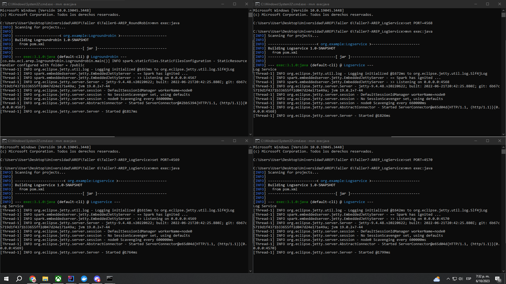
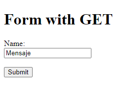
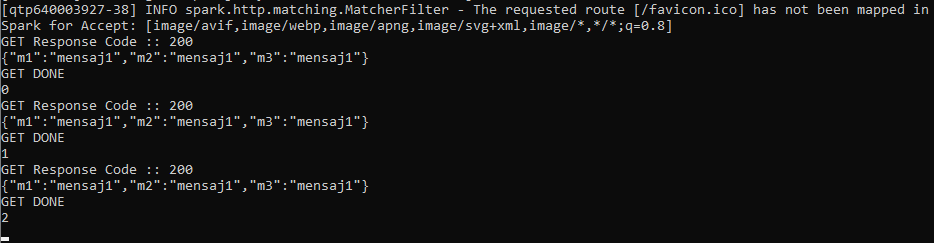
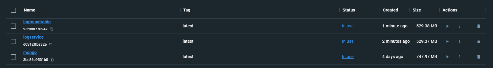
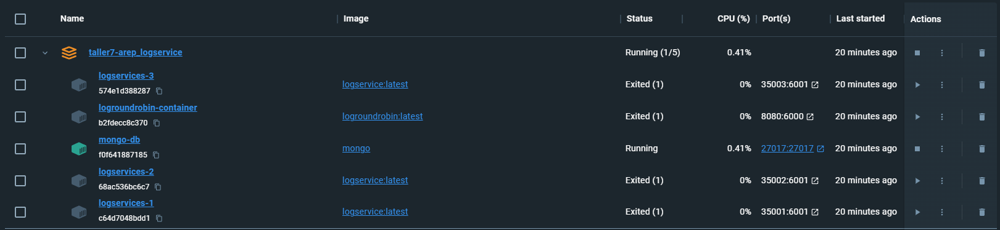

# Taller 6: TALLER DE TRABAJO INDIVIDUAL EN PATRONES ARQUITECTURALES
**Estudiante:** Edwar Fabian Lozano Florez  
**Clase:** AREP  
**Profesor:** Luis Daniel Benavides

## Como funciona
1. Primero se debe clonar los repositorios: https://github.com/EdwarLozano/Taller7-AREP_LogService.git y https://github.com/EdwarLozano/Taller6-AREP_RoundRobin.git
2. En ambos repositorios realizar un:
```
    mvn clean install
```
3. Ahora se deben abrir 4 cmd: 3 desde la carpeta raíz del proyecto Logservice y 1 desde el proyecto de Logroundrobin, esto para observar la funcionalidad del RoundRobin.
4. Ahora en las 3 de Logservice se deben ejecutar estos comandos (Una en cada una):
- 
```
   set PORT=4568
```
-
```
   set PORT=4569
```
-
```
   set PORT=4570
```
5. Ahora se debe ejecutar el comando en las 4 consolas:
```
   mvn exec:java
```
6. Debe verse algo así:

Ahora accedemos a http://localhost:4567 y nos aparecerá el formulario base.

7. Al darle click al botón **Submit** recibimos un mensaje por defecto, y al repetir este proceso irá cambiando el servidor que lo soluciona, esto lo podemos verificar
en la consola de Logrounrobin, este muestra 0, 1 o 2 dependiendo de la consola que lo esté realizando, así:


### Docker
Se crearon las 3 imágenes en Docker:

Y los contenedores a partir de estas:


Nota: Se dejó el trabajo hasta aquí debido a errores que se presentaban al momento de intentar conectar la base de datos y AWS.

## Requisitos 
- Java: Ambiente de desarrollo
- Maven: Administrador del ciclo de vida del Proyecto
- Git: Controlador de versiones
- AWS: Para la creación de las instancias

## Construido con 

IntelliJ IDEA 2022.3.2 (Community Edition)

## Autores 

* **Edwar Fabian Lozano Florez** 